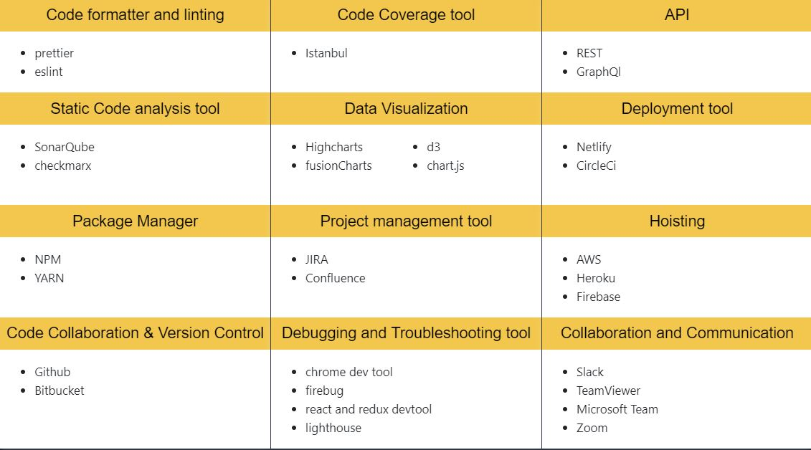

# Hi there 👋, my name is Nikhil Karkra

* I am a Full Stack Javascript/Salesforce Lightning Developer
* I have  5+ years of experience designing, developing, and managing complex web applications and internal frameworks. 
* Proficient in HTML, CSS, JavaScript; plus modern libraries and frameworks.
* Passionate about Responsive web designing, Accessibility, Performance optimization and possess a working knowledge of Progressive web application.
* Experienced in decision-making areas beyond programming such as product development, hiring, etc.
* I learn and build everything that excites me from cooking food to building large scale application

🔭 **I’m currently working on**  Salesforce, react and node microservices

🌱 **I’m currently learning** Python 

👯 **I’m looking to collaborate** on Open source projects 

📫 **How to reach me**: karkra.nikhil@gmail.com 

😄 **Pronouns:** he/him/his 

# Skills
<!-- |       |  |     |
| :---        |    :----:   |          ---: |
|       |        |    | -->

        

